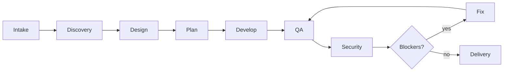
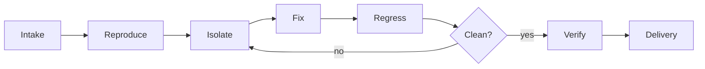

# Forge

**A structured build-and-repair harness for long-running coding work.**

Forge gives coding agents phase discipline, ownership, and continuable state —
so work that spans sessions, days, or interruptions doesn't fall apart.

## The problem

Coding agents are fast but forgetful. On long-running tasks they lose track of
what was decided, who owns what, and where things broke. When a session ends,
context disappears. When it resumes, you re-explain everything.

Forge fixes this by writing project state to files — not chat history — and
structuring work into phases with explicit gates, so every session picks up
exactly where the last one stopped.

## Who this is for

- Multi-session projects where context loss is the bottleneck
- Teams that need an audit trail of specs, designs, and decisions
- Build or repair work that benefits from phase gates instead of open-ended prompting
- Parallel development where lane ownership and merge order matter

## Core UX

### `forge info` — see where you are

Shows current phase, what's blocking, and what to do next. One glance, not a wall of fields.

Internally this is backed by `node scripts/forge-status.mjs`, so the compact dashboard
stays consistent with the runtime's canonical `next_action`.

```
Forge: my-saas-app (build)
Phase 4/9 — develop
████████████░░░░ 55%

Next action: Resume lane auth-api — JWT middleware done, testing refresh token flow
Active: auth-api, payment-ui. Blocked: db-schema (waiting on contract review)

Lanes: 2/5 done, 1 blocked
Issues: 1 blocker, 0 major, 2 minor
Tag: forge/v1-design
```

### `forge continue` — restore saved state and keep going

Restores saved workflow state from `.forge/` — phase, lane ownership, blockers,
handoff notes — and routes to the most actionable point. No re-prompting,
no re-explaining what you were doing.

When using separate CLIs such as Codex CLI and Claude CLI, resume explicitly with
`forge continue` from either host against the same repository checkout. The decision
comes from shared `.forge/` state; only the host automation depth differs.

```
Forge: my-saas-app
Phase 4/9 — develop
3 lanes active, 1 blocked (auth waiting on DB schema)

Next action: Resume lane auth-api — JWT middleware done, testing refresh token flow
```

It picks the right entry point automatically:
- **Blocker that needs your input?** Surfaces that first.
- **Internal blocker?** Routes to the owning team.
- **Analysis is stale?** Refreshes analysis before phase work continues.
- **Active lane with handoff notes?** Loads that lane's worktree and task context.
- **None of the above?** Falls back to the current phase skill.

### `forge analyze` — map impact before you touch code

Runs Forge's Analyst flow to produce a durable codebase analysis artifact for the
active project. This is especially useful before design on existing code, before
lane splitting, and before risky fixes.

Typical uses:
- architecture mapping for an existing codebase
- impact analysis for a target file/module/symbol
- dependency tracing before a fix
- quality/risk scanning before review

### `forge eval` — turn a run into a scorecard

Compares baseline vs harness runs and emits both machine-readable JSON and a markdown
report under `.forge/eval/`. If you do not provide a harness summary, Forge derives one
from the current runtime, status, traceability, and delivery artifacts.

Typical uses:
- capture a Codex or Claude smoke run as an evidence artifact
- compare with/without-Forge outcomes for the same task
- append lightweight product proof to `.forge/events/eval.jsonl`

### `forge` — start a new project or fix an existing one

Forge detects whether you're building something new or fixing something broken,
and routes accordingly.

## Build and repair workflows

Forge runs two structured pipelines. Each phase has a defined input, output, and
gate — work doesn't advance until prerequisites are met.

### Build mode — new projects



| Phase     | What happens                                    | Output                    |
|-----------|-------------------------------------------------|---------------------------|
| Intake    | Evaluate scope, route to build mode              | `.forge/state.json`       |
| Discovery | Gather requirements, eliminate ambiguity          | `.forge/spec.md`          |
| Design    | Architecture, contracts, code rules, UI spec     | `.forge/design/`, `contracts/`, `code-rules.md` |
| Plan      | Native decomposition into lane graph + task briefs | `.forge/plan.md`, `tasks/`, `runtime.json` |
| Develop   | Execute the approved plan in isolated worktrees  | Merged code               |
| QA        | Functional, regression, edge-case testing        | `.forge/holes/`           |
| Security  | OWASP Top 10, secrets scan, auth review          | `.forge/holes/`           |
| Fix       | Resolve blockers (max 3 attempts per issue)      | Fixes merged              |
| Delivery  | Docs, delivery report, client review             | `.forge/delivery-report/` |

### Repair mode — existing codebases



| Phase     | What happens                                          | Output                    |
|-----------|-------------------------------------------------------|---------------------------|
| Intake    | Read existing code, generate baseline artifacts       | `spec.md`, `code-rules.md`, `contracts/` |
| Reproduce | Confirm the bug exists and capture reproduction steps | `.forge/evidence/`        |
| Isolate   | Root cause analysis — narrow to the responsible module | `.forge/evidence/rca-*.md` |
| Fix       | Implement targeted fix in isolated worktree            | Fix branch                |
| Regress   | Verify fix doesn't break adjacent functionality        | `.forge/holes/`           |
| Verify    | Full QA pass on the fix                                | `.forge/holes/`           |
| Delivery  | Update docs, delivery report                           | `.forge/delivery-report/` |

Repair is not "just fix it." It's reproduce → isolate root cause → fix → prove no regressions → verify.

### State lives in files, not chat

Every decision, spec, contract, and issue is written to `.forge/`. When a session
ends and a new one starts, `forge continue` reads these files and picks up.
Nothing depends on chat history surviving.

See [docs/phases.md](./docs/phases.md) for detailed phase gates and ownership.
See [docs/artifacts.md](./docs/artifacts.md) for the full `.forge/` directory reference.

## Quick start

```bash
curl -fsSL https://raw.githubusercontent.com/cjy5507/forge/main/scripts/bootstrap-install.mjs | node --input-type=module - --scope global --force
```

Then:

```
forge                  # start a new project or fix an existing one
forge info             # see current phase, blockers, next steps
forge continue         # restore state and pick up where you left off
forge analyze          # produce/update codebase analysis for the current project
```

This installs Forge globally at `~/.forge/plugins/forge`.
For project-local or other install options, see [Installation details](#installation-details) below.

## Installation details

<details>
<summary>Global install (manual)</summary>

```bash
git clone https://github.com/cjy5507/forge.git "$HOME/.forge/src/forge"
node "$HOME/.forge/src/forge/scripts/setup-plugin.mjs" --scope global --force
```

Prepares the plugin at `~/.forge/plugins/forge`.
</details>

<details>
<summary>Project-local install (manual)</summary>

```bash
git clone https://github.com/cjy5507/forge.git .forge/vendor/forge
node .forge/vendor/forge/scripts/setup-plugin.mjs --scope project --project-root "$PWD" --force
```

Prepares the plugin at `./.forge/plugins/forge`.
</details>

<details>
<summary>Copy mode (no symlinks)</summary>

Add `--mode copy` to any install command:

```bash
curl -fsSL https://raw.githubusercontent.com/cjy5507/forge/main/scripts/bootstrap-install.mjs | node --input-type=module - --scope global --mode copy --force
```
</details>

<details>
<summary>Claude Code marketplace</summary>

```text
/plugin marketplace add cjy5507/forge
/plugin install forge@forge
```

Or with HTTPS:

```text
/plugin marketplace add https://github.com/cjy5507/forge.git
/plugin install forge@forge
```

Point Claude Code at the repository root (the folder containing `.claude-plugin/plugin.json`,
`skills/`, `scripts/`, and `hooks/`), not at `.claude-plugin/` alone.
</details>

<details>
<summary>Codex</summary>

```bash
npm install -g @openai/codex
```

Point the host at the repository root containing `.codex-plugin/plugin.json`.
Recommended roots: `~/.forge/plugins/forge` or `./.forge/plugins/forge`.
</details>

<details>
<summary>Gemini CLI</summary>

```bash
gemini extensions install /absolute/path/to/forge
```

For a linked development install:

```bash
gemini extensions link /absolute/path/to/forge
```

Gemini looks for `gemini-extension.json` at the extension root, so point it at the repository root.
Forge currently supports explicit shared-state flows through Gemini commands such as `/forge:continue`
and `/forge:info`; Claude-style hook lifecycle parity is not claimed.
</details>

<details>
<summary>Qwen Code</summary>

```bash
qwen extensions install /absolute/path/to/forge
```

Or from Git:

```bash
qwen extensions install https://github.com/cjy5507/forge.git
```

Forge ships a native `qwen-extension.json` surface with `skills/`, `agents/`, MCP wiring, and
explicit `/forge:*` commands. Hook lifecycle parity is not claimed; Qwen support currently focuses
on explicit commands and shared `.forge` state.
</details>

## Validation

```bash
npx --yes vitest run scripts/*.test.mts
```

## MCP

Forge ships with [Context7](https://context7.com) configured in `.mcp.json` for documentation
lookups during fact-checking. No API key required.

The package does not bundle codebase-memory MCP servers. `forge analyze` uses those host-
provided tools when they are available; otherwise it must fall back to direct file/module
inspection with lower confidence.

## Host support

| Host | Status | Notes |
|------|--------|-------|
| Claude Code | **Verified** | Full hook lifecycle, subagent routing, lane management |
| Codex | **Degraded support** | Live smoke verified `forge status`, `forge info`, explicit cross-host `forge continue`, and `forge analyze` on shared runtime/skill surfaces. Claude-style hook lifecycle parity is not yet achieved. |
| Gemini CLI | **Degraded support** | Root extension manifest, explicit Forge commands, and shared `.forge` runtime flows are shipped. Session/tool hook parity is not yet claimed. |
| Qwen Code | **Degraded support** | Native `qwen-extension.json`, `skills/`, `agents/`, and explicit `/forge:*` commands are shipped. Hook lifecycle parity is not yet claimed. |

Forge's file-based state system (`.forge/`, `state.json`, `runtime.json`) is host-agnostic.
Explicit `forge continue` through shared `.forge/` state works across Claude and Codex; the deeper
automation layer (hooks, subagent tracking, stop guards) remains Claude-first.

## Links

- [Phase structure](./docs/phases.md)
- [Artifact reference](./docs/artifacts.md)
- [Marketplace copy](./MARKETPLACE.md)
- [Release notes](./RELEASE_NOTES.md)
- [Publishing checklist](./PUBLISHING.md)
