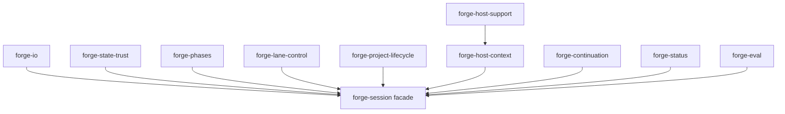

# Forge Architecture

Forge is a file-backed workflow harness OS. The durable control plane lives in `.forge/`,
while host-specific surfaces translate CLI or hook events into that shared state instead of
becoming the source of truth themselves.

## Current shape

The core architecture is now facade-centered rather than god-object-centered:

- `scripts/lib/forge-session.mjs`
  - stable facade for state/runtime APIs and backward-compatible exports
- `scripts/lib/forge-state-store.mjs`
  - read/write flows for `.forge/state.json` and `.forge/runtime.json`
- `scripts/lib/forge-io.mjs`
  - low-level file IO, locks, defaults, and shape normalizers
- `scripts/lib/forge-state-trust.mjs`
  - parse-warning and cross-file consistency checks
- `scripts/lib/forge-phases.mjs`
  - canonical phase sequences, gates, and transition rules
- `scripts/lib/forge-lane-control.mjs`
  - lane mutation helpers for runtime-backed execution
- `scripts/lib/forge-project-lifecycle.mjs`
  - company gate and session handoff updates
- `scripts/lib/forge-continuation.mjs`
  - next-action derivation and continuation routing
- `scripts/lib/forge-status.mjs`
  - canonical status model and text/json rendering
- `scripts/lib/forge-host-support.mjs`
  - host support profiles and degraded-mode declarations
- `scripts/lib/forge-host-context.mjs`
  - cross-host handoff metadata in runtime state
- `scripts/lib/forge-eval.mjs`
  - evidence and scorecard generation under `.forge/eval/` and `.forge/events/`

## Module map

## Data flow

### Continue and status

1. Host wrapper or CLI command enters through a script under `scripts/`
2. The script reads canonical state via the `forge-session` facade
3. Runtime is normalized from `.forge/runtime.json`
4. `deriveNextAction()` selects the actionable next step from shared state
5. Status/continue text or JSON is rendered from that shared model

This keeps `forge info`, `forge status`, and `forge continue` aligned even when
host automation depth differs.

### Planning and develop execution

1. `.forge/plan.md` and `.forge/tasks/*.md` define the lane graph
2. Lane state is persisted in `.forge/runtime.json`
3. Worktrees under `.forge/worktrees/` provide physical isolation per lane
4. Review, merge, rebase, and handoff state flows back into runtime lane records

## Trust model

Forge is intentionally explicit about what it can and cannot guarantee.

What it does today:

- detect JSON parse failures and surface `_trust_warnings`
- validate selected state/runtime contradictions
- normalize malformed or incomplete runtime shape into a degraded but readable state
- keep phase and lane decisions visible in file-backed artifacts
- stamp state/runtime integrity fingerprints for external-modification visibility
- persist deterministic decision traces for key guarded actions

What it does not do today:

- cryptographically sign `.forge/state.json` or `.forge/runtime.json`
- prevent a deliberate local editor from changing state files
- provide a secret-backed tamper-proof integrity boundary

That means current trust handling is best described as:

- parse/corruption detection
- contradiction correction
- degraded-state visibility

It should not be described as strong tamper protection.

What it aims to be:

- deterministic execution control plane
- guarded verification harness
- recoverable failure-routing layer
- bounded degraded behavior across hosts

## Host support model

Forge treats host support as an explicit capability contract, not as prose guesswork.

Current posture:

| Host | Support level | Core claim |
|------|---------------|------------|
| Claude Code | verified | Full hook-driven workflow remains the strongest path |
| Codex | degraded | Shared-state continue/status/analyze are real; Claude-style hook parity is not |
| Gemini CLI | degraded | Explicit command and shared-runtime flows are supported; hook parity is not claimed |
| Qwen Code | degraded | Native extension surface and shared-runtime flows are supported; hook parity is not claimed |

The authoritative runtime capability surface lives in:

- `scripts/lib/forge-host-support.mjs`
- `scripts/lib/forge-host-context.mjs`
- `.forge/contracts/host-adapter.ts`
- `.forge/contracts/resume-bridge.ts`

Forge now treats host support as two separate questions:

- **Observed lifecycle:** did we actually observe hooks, stop semantics, and subagent lifecycle on this host?
- **Determinism floor:** even when lifecycle depth is degraded, does the host still guarantee shared continue/status/analyze and visibility of decision, verification, and recovery state?

## Evidence surfaces

Forge keeps proof artifacts separate from runtime control state:

- `.forge/evidence/` for analysis and verification notes
- `.forge/eval/` for scorecards
- `.forge/events/` for append-only operational records
- `.forge/delivery-report/` for final delivery summaries

This keeps product claims anchored to durable artifacts instead of only chat output.

## Design constraints

- Shared `.forge` state stays host-agnostic
- Runtime metadata may enrich context, but must not fork the core routing model
- Additive schema evolution is preferred over destructive rewrites
- Degraded paths should remain visible instead of silently bypassing workflow rules
- Deterministic runtime explanations matter more than breadth of workflow surfaces
- Verification and recovery should be visible as first-class harness state, not only hook side effects
